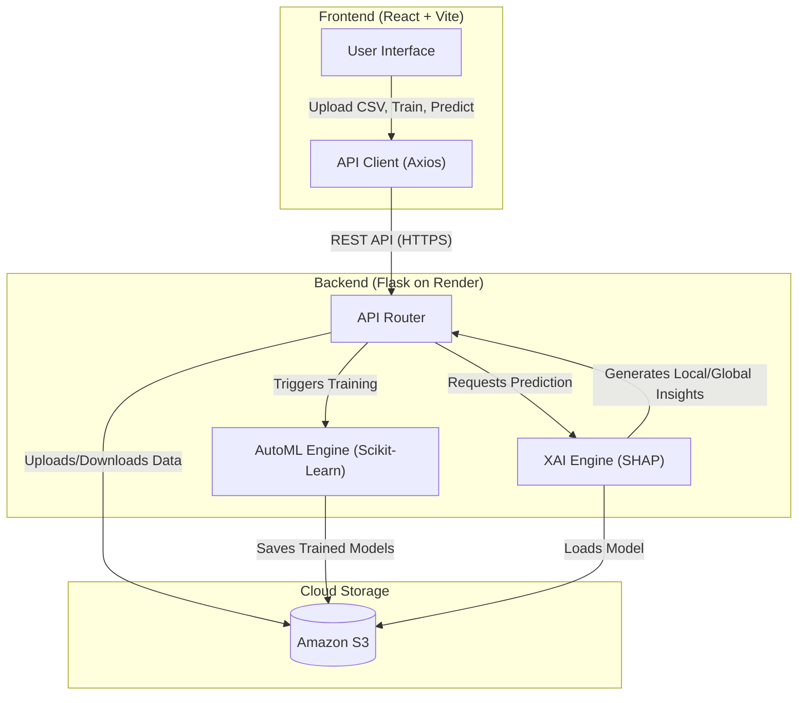

# AutoML Frontend

A modern, interactive frontend application for the AutoML platform. Built with React and Vite, it provides a seamless user experience for uploading datasets, training machine learning models automatically, and making predictions—all wrapped in a beautiful, dark-themed UI with rich animations.

## ✨ Features

- **Drag & Drop Upload:** Easily upload your CSV datasets with an intuitive dropzone interface.
- **Dataset Analysis:** Automatically detects feature types (numeric vs. categorical) and provides a preview of your data.
- **Automated Machine Learning:** Select your target column and let the backend automatically extract features, train multiple models, tune hyperparameters, and validate them.
- **Training Visualization:** Rich animations and process logs keep you informed during the "Neural Synapse" and "Hyperparameter Tuning" phases.
- **Model Leaderboard:** Compare different models (Random Forest, Gradient Boosting, SVM, etc.) based on CV, Train, and Test scores.
- **Downloadable Reports:** Generate detailed PDF reports of the analysis, training process, and evaluation results using `jsPDF`.
- **Model Export:** Download the best performing trained model directly as a `.zip` file for deployment.
- **Interactive Predictions:** Use a dynamic form to input new data and get instant predictions from your trained models.

## 🛠️ Tech Stack

- **Core:** [React 18](https://reactjs.org/) & [Vite](https://vitejs.dev/)
- **Styling:** [Tailwind CSS](https://tailwindcss.com/)
- **Icons:** [Lucide React](https://lucide.dev/)
- **HTTP Client:** [Axios](https://axios-http.com/)
- **File Uploads:** [React Dropzone](https://react-dropzone.js.org/)
- **PDF Generation:** [jsPDF](https://github.com/parallax/jsPDF) & [jsPDF-AutoTable](https://github.com/simonbengtsson/jsPDF-AutoTable)

## 🚀 Getting Started

### Prerequisites

- Node.js (v16 or higher recommended)
- npm or yarn

### Installation

1. Navigate to the frontend directory:
   ```bash
   cd frontend
   ```

2. Install the dependencies:
   ```bash
   npm install
   ```

3. Start the development server:
   ```bash
   npm run dev
   ```

4. Open your browser and navigate to the local server address (usually `http://localhost:5173`).

## ⚙️ Configuration

The backend API URL is configured in `src/App.jsx`. By default, it points to the production backend:
```javascript
const API_BASE_URL = "https://automl-backend-hw8s.onrender.com";
```
If you are running the backend locally, you may need to change this to `http://localhost:5000` (or whichever port your backend uses) for development.

## 📝 Scripts

- `npm run dev`: Starts the Vite development server.
- `npm run build`: Bundles the application for production.
- `npm run lint`: Runs ESLint to check for code quality issues.
- `npm run preview`: Locally previews the production build.

## 🤝 Troubleshooting

**CORS Errors on Upload/Train:**
If you encounter a CORS error (e.g., `No 'Access-Control-Allow-Origin' header is present`), it typically means the backend server is either asleep (if hosted on a free tier like Render) or there is an unhandled exception on the backend side causing it to drop CORS headers. Check the backend logs to ensure it's running properly.

## 🏗️ System Design

The AutoML platform follows a modern, decoupled client-server architecture:



### Architecture Components

1. **Frontend (Client-Side):**
   - Handles data visualization, user inputs, and manages the state of the machine learning workflow.
   - Built as a Single Page Application (SPA) using React, styled with Tailwind CSS, and bundled with Vite.
   - Deployed on a CDN (e.g., Vercel) for high availability and fast content delivery.

2. **Backend (Server-Side):**
   - A Python Flask application serving as the brain of the platform.
   - Exposes RESTful endpoints (`/upload`, `/train`, `/predict`, `/analyze-column`).
   - Uses `pandas` and `scikit-learn` to automatically preprocess data, tune hyperparameters, and select the best model.
   - Uses `SHAP` (SHapley Additive exPlanations) to generate model insights and feature importances.
   - Typically hosted on cloud platforms like Render or Heroku.

3. **Cloud Storage (AWS S3):**
   - Used as a centralized blob storage.
   - **Datasets (`datasets/`):** Uploaded CSVs are temporarily/permanently stored here to decouple them from the application server.
   - **Models (`models/`):** Trained models (`.pkl` files) and their metadata are serialized and stored. When a prediction is requested, the backend pulls the respective model from S3 and caches it in memory.
